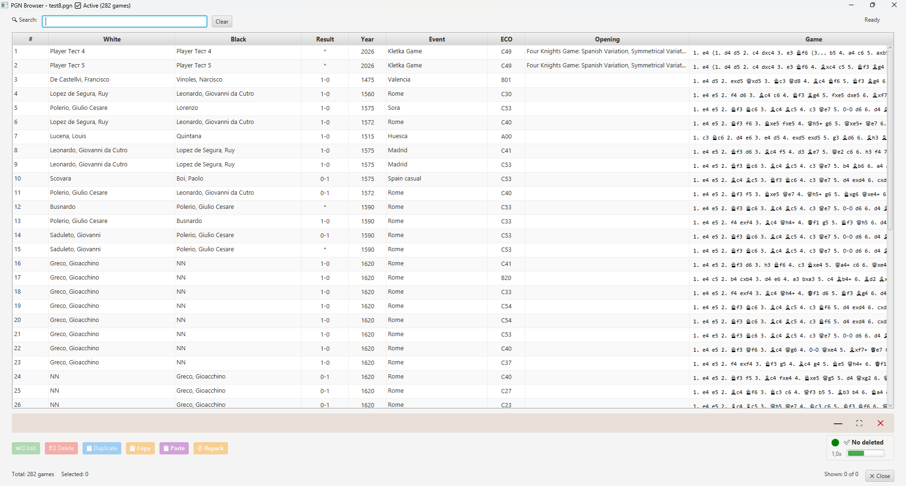
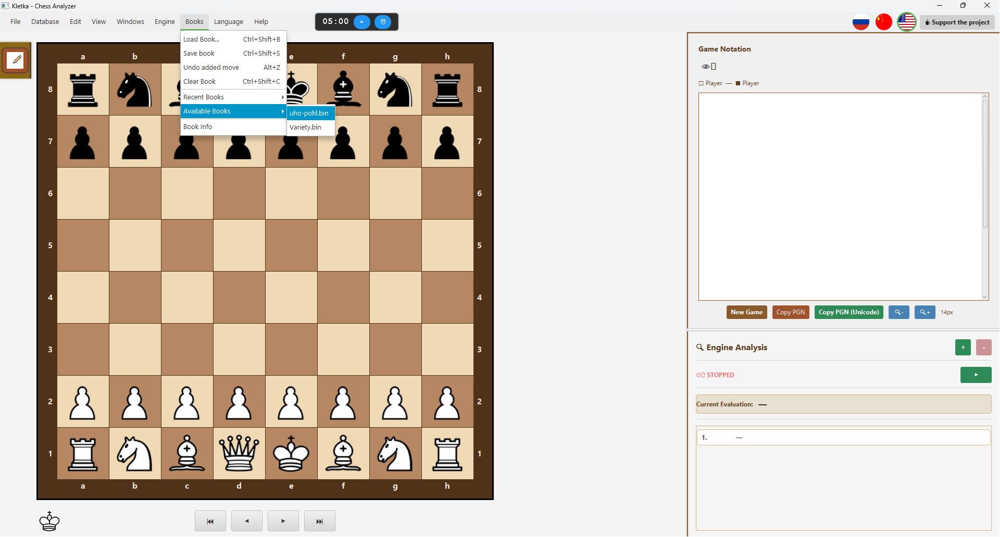
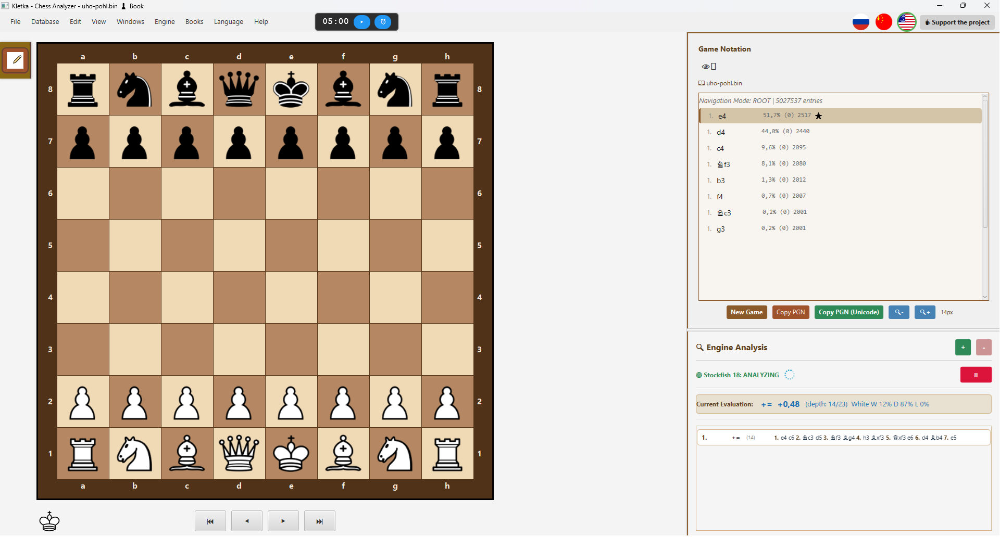

# ♟️ Kletka — Cross-Platform Chess Analyzer

## 🌐 **Website:** [https://andreykhrypach.github.io/Kletka/](https://andreykhrypach.github.io/Kletka/)

**Read this in:**
[🇬🇧 English](README.md) |
[🇷🇺 Русский](README.ru.md) |
[🇨🇳 中文](README.zh.md)

---

**Kletka** is a cross-platform chess analysis tool that supports PGN files, variations, annotations, and the Stockfish engine. It features a modern, customizable interface and is available for Windows, Linux, and macOS.

## 📝 Changelog

See [CHANGELOG.md](CHANGELOG.md) for a detailed history of changes.

---

## 🚀 Features

- 📁 Open, edit, and save PGN files
- 🧩 Full support for variations and annotations
- 📚 **Polyglot opening books** — load and browse opening variations
- 🔍 Position analysis with **Stockfish** (UCI engine)
- 🎨 Customizable board themes
- 🌍 Multilingual: English, Russian, Chinese
- 🖥️ Cross-platform: Windows, Linux, macOS

---

## 📚 Opening Books (Polyglot)

Kletka supports **Polyglot opening books** (`.bin` files), allowing you to explore and study chess openings interactively.

### How to use opening books:

1. Go to **Books → Load Book**
2. Select a Polyglot book file (`.bin`)
3. Navigate through variations using the keyboard:
    - **↑ / ↓** — move between variations
    - **→ / Enter** — select a variation
    - **←** — go back to the previous position

### System Requirements for Books

For opening book functionality, Kletka requires:

- **Java 17 LTS** (Liberica Full JDK recommended)
- JVM arguments (automatically applied when running from the launcher):

--add-opens java.base/sun.nio.ch=ALL-UNNAMED

--add-opens java.base/sun.misc=ALL-UNNAMED


**Note:** If you're running Kletka from the command line, use:
```bash
java --add-opens java.base/sun.nio.ch=ALL-UNNAMED --add-opens java.base/sun.misc=ALL-UNNAMED -jar Kletka.jar
```

These arguments are required for fast Polyglot book operations using memory-mapped files.

### Linux: Known Issues

On **Debian Trixie / Ubuntu 24.04+** with **Wayland**, dialogs may not receive focus
(keyboard works, mouse doesn't). This is a **known JavaFX 17 + GTK 3 + Wayland bug**.

**Solution:** already included in Kletka — the app runs with

`-Djdk.gtk.version=2`, 
which uses GTK 2 via XWayland.
---

### Recommended books:

For best results, we recommend using the **`uho-pohl.bin`** opening book, which contains extensive high-quality opening variations.

### Where to get Polyglot books:

You can download free opening books from the official Polyglot books repository:
🔗 **[Polyglot Books Repository](https://github.com/ChrisWhittington/polyglot-books)**

Other popular sources:
- [UHO-Pohl openings](https://www.chessdb.com/) — high-quality opening database
- [ChessTempo's Polyglot books](https://www.chesstempo.com/)
- Create your own using the Polyglot format

---

## 🖥️ Screenshots

### Quick Preview

<table>
  <tr>
    <td></td>
    <td></td>
  </tr>
  <tr>
    <td><em>Main interface</em></td>
    <td><em>PGN browser</em></td>
  </tr>
  <tr>
    <td></td>
    <td></td>
  </tr>
  <tr>
    <td><em>Open Polyglot Book</em></td>
    <td><em>Polyglot Book Loaded</em></td>
  </tr>
</table>

---

## 🖥️ Full Size


---

## 📦 Installation

### Windows
Download `Kletka.exe` from the [Releases](https://github.com/AndreyKhrypach/Kletka/releases) page and run the installer.

### macOS
Download `Kletka.dmg`, open it, and drag `Kletka.app` to the `Applications` folder.

### Linux (Debian/Ubuntu)
```bash
sudo dpkg -i kletka*.deb
```

## 🛠️ Building from Source

### Prerequisites
- **Java 17 (Liberica Full JDK recommended)** — download from [BellSoft](https://bell-sw.com/pages/downloads/#/java-17-lts)
- **Maven** — install via `brew install maven` (macOS) or `sudo apt install maven` (Linux)

### Important JVM Arguments for Development
When running from your IDE, add these VM options:

--add-opens java.base/sun.nio.ch=ALL-UNNAMED
--add-opens java.base/sun.misc=ALL-UNNAMED

This ensures full Polyglot book support during development.

```bash
git clone https://github.com/AndreyKhrypach/Kletka.git
cd Kletka
mvn clean package
```
Platform-specific builds
```bash
# Windows

mvn clean package -P windows

# Linux

mvn clean package -P linux

# macOS

mvn clean package -P mac
```
---
## 🧠 Setting up Stockfish

Kletka uses the Stockfish UCI engine for analysis. You need to install it separately:

Windows

    Download Stockfish from the official website: https://stockfishchess.org/download/

    Extract the archive

    In Kletka, go to Engine → Configure Engine and select the stockfish.exe file

Linux (Debian/Ubuntu)
```bash
sudo apt install stockfish
```

Then in Kletka, go to Engine → Configure Engine and select the stockfish binary.

macOS
```bash
brew install stockfish
```

Then in Kletka, go to Engine → Configure Engine and select the stockfish binary.

---

## 📄 License

This project is licensed under the GNU General Public License v3.0.
See the [LICENSE]([LICENSE](https://github.com/AndreyKhrypach/Kletka/blob/master/LICENSE) file for details.

---

## 👨‍💻 Author

Andrey Khrypach

---

## ⭐ Support

If you like this project, please ⭐ it on GitHub!
