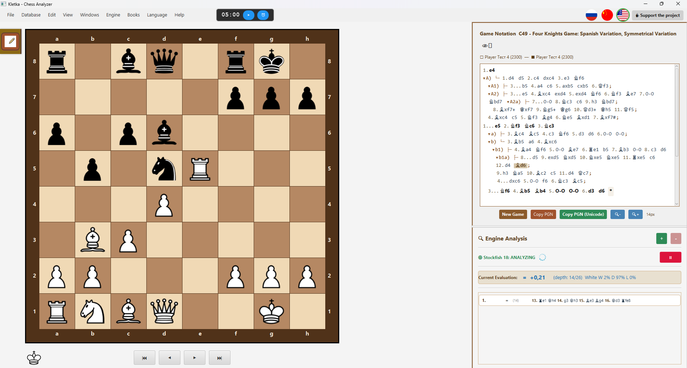

# ♟️ Kletka — Cross-Platform Chess Analyzer

**Kletka** is a cross-platform chess analysis tool that supports PGN files, variations, annotations, and the Stockfish engine. It features a modern, customizable interface and is available for Windows, Linux, and macOS.

---

## 🚀 Features

- 📁 Open, edit, and save PGN files  
- 🧩 Full support for variations and annotations  
- 🔍 Position analysis with **Stockfish** (UCI engine)  
- 🎨 Customizable board themes  
- 🌍 Multilingual: English, Russian, Chinese  
- 🖥️ Cross-platform: Windows, Linux, macOS  

---

## 🖥️ Screenshots

### English
|  |  |

### Русский
|  |  |

### 中文 (Chinese)
|  |  |

---

## 📦 Installation

### Windows
Download `Kletka.exe` from the [Releases](https://github.com/AndreyKhrypach/Kletka/releases) page and run the installer.

### macOS
Download `Kletka.dmg`, open it, and drag `Kletka.app` to the `Applications` folder.

### Linux (Debian/Ubuntu)
```bash
sudo dpkg -i kletka_1.0-1_amd64.deb
````
🛠️ Building from Source

````bash

git clone https://github.com/AndreyKhrypach/Kletka.git
cd Kletka
mvn clean package
````
Platform-specific builds
````bash

# Windows

mvn clean package -P windows

# Linux

mvn clean package -P linux

# macOS

mvn clean package -P mac
````
---
🧠 Setting up Stockfish

Kletka uses the Stockfish UCI engine for analysis. You need to install it separately:
Windows

    Download Stockfish from the official website

    Extract the archive

    In Kletka, go to Engine → Configure Engine and select the stockfish.exe file

Linux (Debian/Ubuntu)
````bash

sudo apt install stockfish
````

Then in Kletka, go to Engine → Configure Engine and select the stockfish binary.
macOS
````bash

brew install stockfish
````

Then in Kletka, go to Engine → Configure Engine and select the stockfish binary.

---

📄 License

This project is licensed under the GNU General Public License v3.0.
See the LICENSE file for details.

---

👨‍💻 Author

Andrey Khrypach

---

⭐ Support

If you like this project, please ⭐ it on GitHub!
