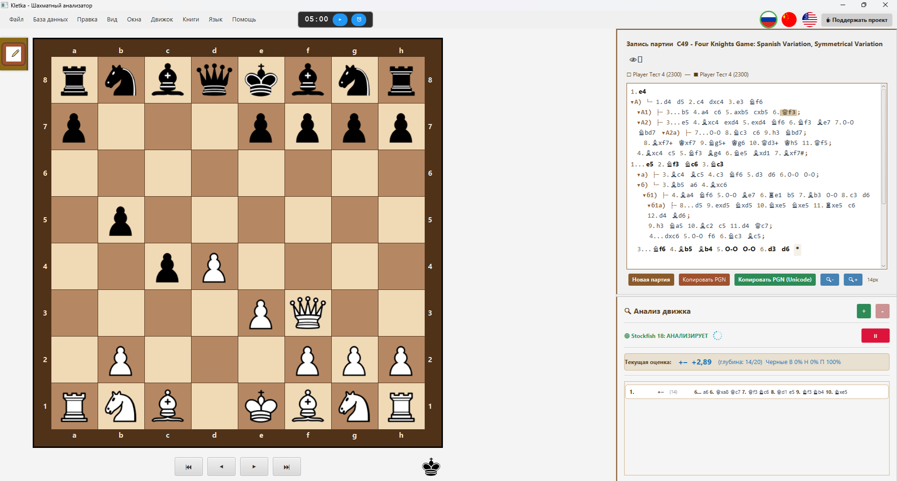
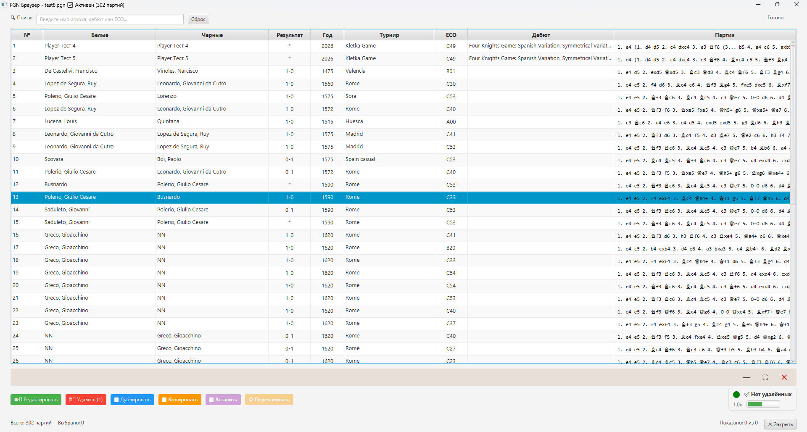
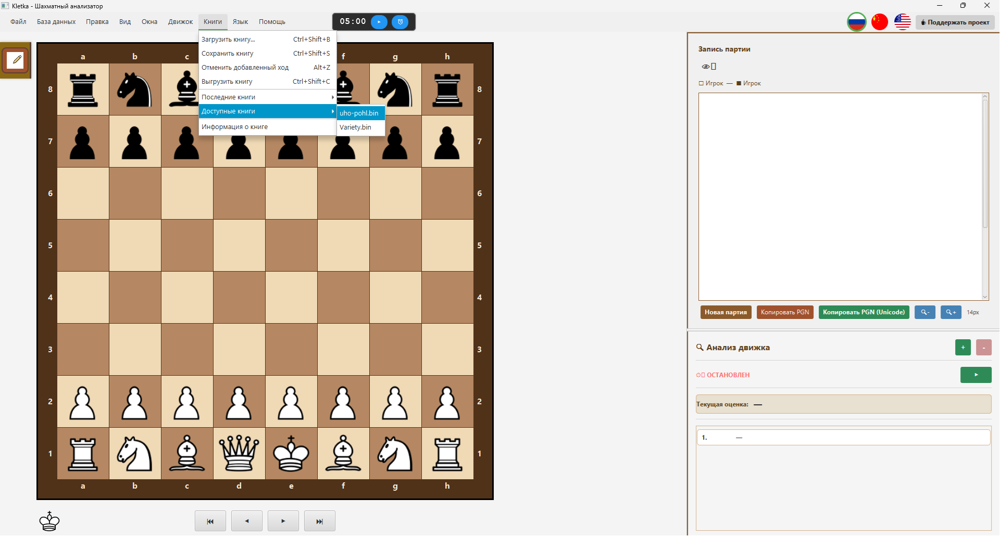
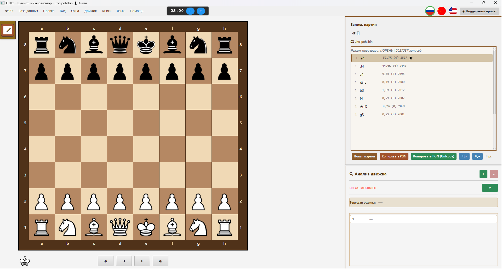

# ♟️ Kletka — Кроссплатформенный шахматный анализатор

## 🌐 **Website:** [https://andreykhrypach.github.io/Kletka/](https://andreykhrypach.github.io/Kletka/)

**Читать на:**
[🇬🇧 English](README.md) |
[🇷🇺 Русский](README.ru.md) |
[🇨🇳 中文](README.zh.md)

**Kletka** — это кроссплатформенный шахматный анализатор с поддержкой PGN файлов, вариантов, аннотаций и движка Stockfish. Программа имеет современный настраиваемый интерфейс и доступна для Windows, Linux и macOS.

## 📝 Журнал изменений

Подробную историю изменений смотрите в [CHANGELOG.md](CHANGELOG.md).

---

## 🚀 Возможности

- 📁 Открытие, редактирование и сохранение PGN файлов
- 🧩 Полная поддержка вариантов и аннотаций
- 📚 **Дебютные книги Polyglot** — загрузка и просмотр дебютных вариантов
- 🔍 Анализ позиции с **Stockfish** (UCI движок)
- 🎨 Настраиваемые темы доски
- 🌍 Мультиязычность: Русский, English, 中文
- 🖥️ Кроссплатформенность: Windows, Linux, macOS

---

## 📚 Дебютные книги (Polyglot)

Kletka поддерживает **дебютные книги Polyglot** (файлы `.bin`), что позволяет вам интерактивно изучать шахматные дебюты.

### Как использовать дебютные книги:

1. Перейдите в меню **Книги → Загрузить книгу**
2. Выберите файл Polyglot книги (`.bin`)
3. Навигация по вариантам с помощью клавиатуры:
    - **↑ / ↓** — перемещение между вариантами
    - **→ / Enter** — выбор варианта
    - **←** — возврат на предыдущую позицию

### Системные требования для книг

Для работы с дебютными книгами Kletka требует:

    Java 17 LTS (рекомендуется Liberica Full JDK)

    Аргументы JVM (автоматически применяются при запуске через лаунчер):

```
--add-opens java.base/sun.nio.ch=ALL-UNNAMED
--add-opens java.base/sun.misc=ALL-UNNAMED
```

**Примечание:** Если вы запускаете Kletka из командной строки, используйте:

```bash
java --add-opens java.base/sun.nio.ch=ALL-UNNAMED \
--add-opens java.base/sun.misc=ALL-UNNAMED \
-jar Kletka.jar
```

Эти аргументы необходимы для быстрой работы с Polyglot книгами с использованием файлов, отображаемых в память (mmap).

### 🔧 Технические детали: Memory-Mapped Files

Kletka использует **memory-mapped files** (`MappedByteBuffer`) для молниеносно быстрой работы с Polyglot книгами, даже на HDD.

**Важно:** Mapped byte buffer **не освобождается** сборщиком мусора JVM, пока на него есть ссылка. Чтобы вы могли **удалить, переместить или заменить** файл книги во время работы Kletka, приложение явно вызывает:

```
sun.misc.Unsafe.invokeCleaner(mappedByteBuffer);
```

Это немедленно снимает блокировку файла на уровне ОС.

**Что это значит для вас:**
- ✅ Можно безопасно **удалять** и **перемещать** `.bin` файл после выгрузки книги
- ✅ Можно **заменять** файл книги на новый
- ✅ Никаких ошибок "файл занят другим процессом" на Windows

### Linux: известные проблемы

На **Debian Trixie / Ubuntu 24.04+** с **Wayland** диалоги могут не получать фокус
(клавиатура работает, мышь — нет). Это **известный баг JavaFX 17 + GTK 3 + Wayland**.

**Решение:** уже включено в Kletka — приложение запускается с флагом
`-Djdk.gtk.version=2`, который использует GTK 2 через XWayland.
---

### Рекомендуемые книги:

Для наилучших результатов мы рекомендуем использовать книгу **`uho-pohl.bin`**, которая содержит обширные качественные дебютные варианты.

### Где взять Polyglot книги:

Вы можете скачать бесплатные дебютные книги из официального репозитория Polyglot:
🔗 **[Polyglot Books Repository](https://github.com/ChrisWhittington/polyglot-books)**

Другие популярные источники:
- [UHO-Pohl openings](https://www.chessdb.com/) — качественная база дебютов
- [ChessTempo's Polyglot books](https://www.chesstempo.com/)
- Создайте свою собственную книгу в формате Polyglot

---

## 🖥️ Скриншоты

### Краткий обзор

<table>
  <tr>
    <td></td>
    <td></td>
  </tr>
  <tr>
    <td><em>Главный интерфейс</em></td>
    <td><em>Обозреватель PGN</em></td>
  </tr>
  <tr>
    <td></td>
    <td></td>
  </tr>
  <tr>
    <td><em>Открытие Polyglot книги</em></td>
    <td><em>Загруженная Polyglot книга</em></td>
  </tr>
</table>

---

## 🖥️ Полный размер


---
---

## 📦 Установка

### Windows
Скачайте `Kletka.exe` со страницы [Releases](https://github.com/AndreyKhrypach/Kletka/releases) и запустите установщик.

### macOS
Скачайте `Kletka.dmg`, откройте его и перетащите `Kletka.app` в папку `Applications`.

### Linux (Debian/Ubuntu)
```bash
sudo dpkg -i kletka*.deb
```
---

## 🛠️ Сборка из исходников

### Требования
- **Java 17** (рекомендуется Liberica Full JDK) — скачайте с [BellSoft](https://bell-sw.com/pages/downloads/#/java-17-lts)
- **Maven** — установите через `brew install maven` (macOS) или `sudo apt install maven` (Linux)

### Важные аргументы JVM для разработки

При запуске из IDE добавьте следующие параметры VM:

```
--add-opens java.base/sun.nio.ch=ALL-UNNAMED
--add-opens java.base/sun.misc=ALL-UNNAMED
```

Это обеспечивает полную поддержку Polyglot книг во время разработки.

```bash
git clone https://github.com/AndreyKhrypach/Kletka.git
cd Kletka
mvn clean package
```
### Сборка для конкретной платформы

```bash

# Windows
mvn clean package -P windows

# Linux
mvn clean package -P linux

# macOS
mvn clean package -P mac
```

## 🧠 Настройка Stockfish

Kletka использует движок Stockfish для анализа. Вам нужно установить его отдельно.

### Windows

1. Скачайте Stockfish с официального сайта: https://stockfishchess.org/download/
2. Распакуйте архив
3. В Kletka перейдите в **Движок → Настроить движок** и выберите файл `stockfish.exe`

### Linux (Debian/Ubuntu)

```bash
sudo apt install stockfish
```

Затем в Kletka перейдите в **Движок → Настроить движок** и выберите бинарный файл stockfish.

### macOS

```bash
brew install stockfish
```

Затем в Kletka перейдите в Движок → Настроить движок и выберите бинарный файл stockfish.

---

## 📄 Лицензия

Этот проект распространяется под лицензией GNU General Public License v3.0.
Подробнее см. файл [LICENSE](LICENSE).

---

## 👨‍💻 Автор

Andrey Khrypach

---

## ⭐ Поддержка

Если вам нравится проект, поставьте ⭐ на GitHub!