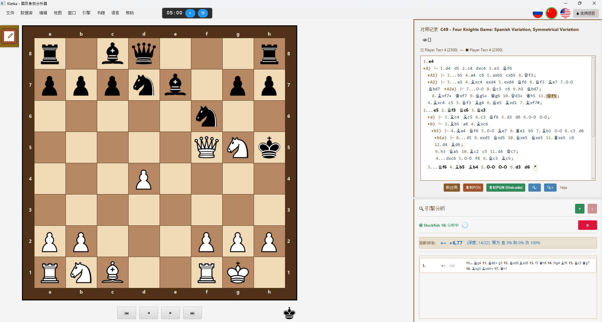
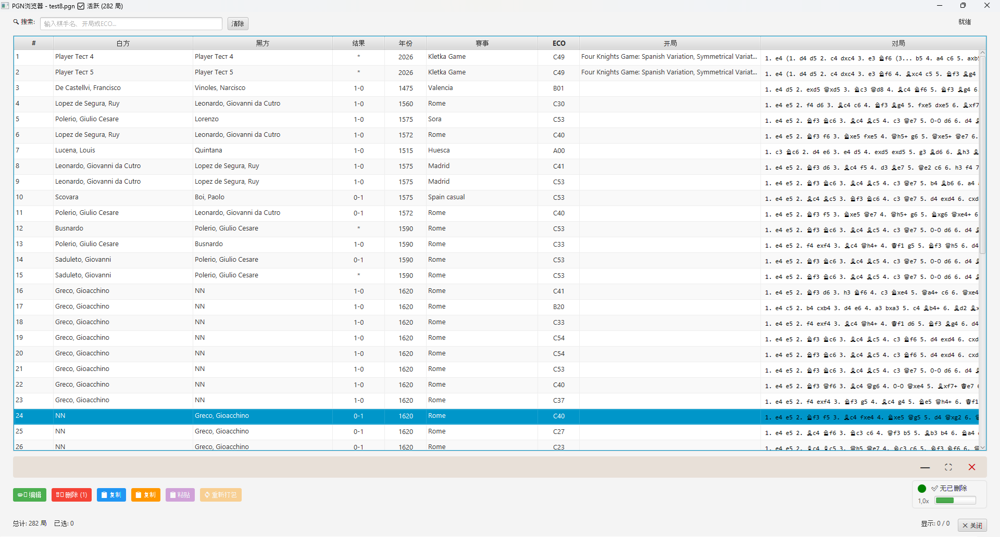
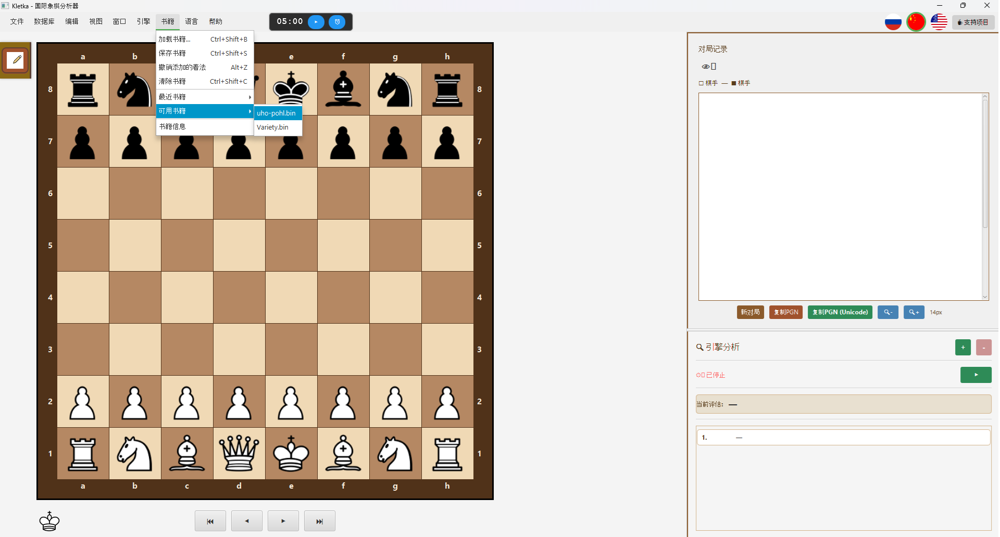
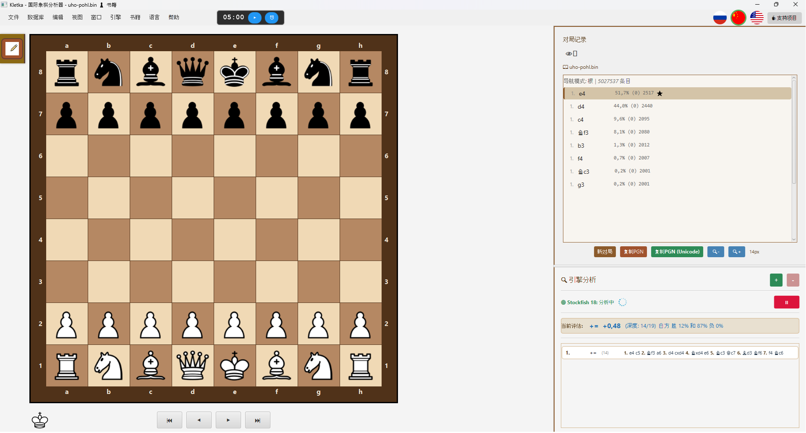

# # ♟️ Kletka — 跨平台国际象棋分析工具

[](https://github.com/AndreyKhrypach/Kletka/releases/latest)
[](https://www.gnu.org/licenses/gpl-3.0)
[]()

## 🌐 **Website:** [https://andreykhrypach.github.io/Kletka/](https://andreykhrypach.github.io/Kletka/)

**阅读语言：**
[🇬🇧 English](README.md) |
[🇷🇺 Русский](README.ru.md) |
[🇨🇳 中文](README.zh.md)

---

**Kletka** 是一款跨平台国际象棋分析工具，支持 PGN 文件、变着、注释和 Stockfish 引擎。它具有现代可定制的界面，适用于 Windows、Linux 和 macOS。

## 📝 更新日志

详细更改历史请参阅 [CHANGELOG.md](CHANGELOG.md)。

---

## 🚀 功能特点

- 📁 打开、编辑和保存 PGN 文件
- 🧩 完整支持变着和注释
- 📚 **Polyglot 开局库** — 加载、浏览和 **编辑** 开局变着
- 📤 **将变例树导出为 Polyglot 开局库** — 保存个人棋路
- 🔍 使用 **Stockfish** (UCI 引擎) 进行局面分析
- 🎨 可定制的棋盘主题
- 📋 **复制局面** 为 FEN + ASCII 格式 (Ctrl+Shift+P)
- 🌍 多语言支持：英语、俄语、中文
- 🖥️ 跨平台：Windows、Linux、macOS

---

## 📺 视频教程

我们在 YouTube 频道上的分步指南：

- [Kletka 教程：Windows 安装](https://www.youtube.com/watch?v=OSaSA-Qm0GY)
- [Kletka 教程：Windows — 设置 Stockfish](https://www.youtube.com/watch?v=TWhIM4zsmIY)
- [Kletka 教程：如何使用 Polyglot 开局库](https://www.youtube.com/watch?v=QAz95CSiDy0)

更多教程即将推出 — Windows、Linux、macOS。

---

## 📚 开局库 (Polyglot)

Kletka 支持 **Polyglot 开局库** (`.bin` 文件)，让您可以交互式地探索和学习国际象棋开局 — 也可以创建您**自己的**棋路。

### 如何使用开局库：

1. 进入 **书籍 → 加载书籍**
2. 选择 Polyglot 书籍文件 (`.bin`)
3. 使用键盘浏览变着：
   - **↑ / ↓** — 在变着之间移动
   - **→ / Enter** — 选择变着
   - **←** — 返回上一位置

### 如何编辑开局库：

Kletka 允许您直接将走法添加到已加载的开局库中：

- 在棋盘上走一步 — 它会自动添加到开局库
- 按 **Alt+Z** — 撤销最后添加的走法
- **书籍 → 保存书籍** (Ctrl+Shift+S) — 将更改应用到 `.bin` 文件
- **书籍 → 卸载书籍** (Ctrl+Shift+C) — 卸载开局库

### 将变例树导出为 Polyglot 开局库：

您可以将当前分析树导出为 Polyglot 开局库：

1. 分析或摆好一个带变着的局面
2. 进入 **书籍 → 导出为 Polyglot 开局库...**
3. 选择文件夹和文件名 — 开局库以 `.bin` 格式创建

树中的所有走法（主线 + 所有变着）都会进入开局库。转置和重复自动去重。

生成的开局库可以重新加载到 Kletka，也可以在 Stockfish、Leela、ChessBase、Scid、Arena 等兼容软件中使用。

### 书籍的系统要求

Kletka 的开局书功能需要以下环境：

- **Java 17 LTS**（推荐使用 Liberica Full JDK）
- JVM 参数（通过启动器运行时自动应用）：

```
--add-opens java.base/sun.nio.ch=ALL-UNNAMED
--add-opens java.base/sun.misc=ALL-UNNAMED
```

**注意：** 如果您从命令行运行 Kletka，请使用：

```bash
java --add-opens java.base/sun.nio.ch=ALL-UNNAMED \
--add-opens java.base/sun.misc=ALL-UNNAMED \
-jar Kletka.jar
```

这些参数对于使用内存映射文件进行快速 Polyglot 开局库操作是必需的。

### 🔧 技术细节：内存映射文件

Kletka 使用 **内存映射文件** (`MappedByteBuffer`) 实现极快的 Polyglot 开局库操作，即使在 HDD 上也是如此。

**重要提示：** 只要存在引用，内存映射字节缓冲区就**不会**被 JVM 垃圾回收器释放。为了让您在 Kletka 运行时能够**删除、移动或替换**开局库文件，应用程序会显式调用：

```
sun.misc.Unsafe.invokeCleaner(mappedByteBuffer);
```

这会立即释放操作系统级别的文件锁定。

**这对您意味着什么：**
- ✅ 卸载开局库后可以安全地**删除**或**移动** `.bin` 文件
- ✅ 可以将开局库文件**替换**为新文件
- ✅ 在 Windows 上不会再出现"文件被另一个进程占用"的错误

### Linux：已知问题

在 **Debian Trixie / Ubuntu 24.04+** 上使用 **Wayland** 时，对话框可能无法获得焦点
（键盘可以工作，但鼠标无法工作）。这是 **JavaFX 17 + GTK 3 + Wayland 的已知 bug**。

**解决方案：** 已在 Kletka 中包含——应用程序启动时带有
`-Djdk.gtk.version=2` 标志，通过 XWayland 使用 GTK 2。

---

### 推荐书籍：

为获得最佳效果，我们推荐使用 **`uho-pohl.bin`** 开局库，其中包含大量高质量的开局变着。

### 如何获取 Polyglot 书籍：

您可以从官方 Polyglot 书籍仓库下载免费的开局库：
🔗 **[Polyglot Books Repository](https://github.com/ChrisWhittington/polyglot-books)**

其他热门来源：
- [UHO-Pohl openings](https://www.chessdb.com/) — 高质量开局数据库
- [ChessTempo's Polyglot books](https://www.chesstempo.com/)
- 使用 Polyglot 格式创建自己的书籍

---

## 📋 复制局面 (FEN + ASCII)

您可以将当前局面以方便的格式复制到剪贴板 — **FEN** 加上 **ASCII 图表**：

- 菜单：**编辑 → 复制局面**
- 快捷键：**Ctrl+Shift+P**

这适用于：

- 在聊天、论坛或 issue 跟踪器中分享局面
- 与 AI 助手一起分析局面
- 在文本文件中记录局面

输出包含第一行的 FEN 和下方的 ASCII 图表，包裹在 Markdown 代码块中以便粘贴。

---

## 🐛 macOS 上的已知问题

### 拖放：棋子被"抓角"

**症状：**
- 棋子视觉上被抓角，而不是中心。
- 要完成走子，需要将鼠标拖到目标格子的角落。
- 放下后，光标可能会消失，直到鼠标进入菜单区域。

**原因：**
JavaFX 已知 bug **JDK-8333919** — 在 macOS 上忽略 `dragViewOffsetX/Y`。

**修复：**
已在 **JavaFX 23** 中修复（需要 **JDK 21+**）。
Kletka 当前使用 **Java 17** + **JavaFX 17**。

**解决方法：**
- 使用 **click-to-move**（点击棋子 → 点击目标格）代替拖放。
- 或者等待 Kletka 迁移到 **JDK 25** + **JavaFX 25**（计划在未来版本中）。

**状态：**
在 issue #XXX 中跟踪。将在迁移到新堆栈时修复。

---

## 🖥️ 截图

### 快速预览

<table>
  <tr>
    <td></td>
    <td></td>
  </tr>
  <tr>
    <td><em>主界面</em></td>
    <td><em>PGN 浏览器</em></td>
  </tr>
  <tr>
    <td></td>
    <td></td>
  </tr>
  <tr>
    <td><em>打开 Polyglot 开局库</em></td>
    <td><em>已加载的 Polyglot 开局库</em></td>
  </tr>
</table>

---

## 🖥️ 完整尺寸


---

## 📦 安装

### Windows
从 [Releases](https://github.com/AndreyKhrypach/Kletka/releases) 页面下载 `Kletka.exe` 并运行安装程序。

### macOS
下载 `Kletka.dmg`，打开并将 `Kletka.app` 拖到 `Applications` 文件夹。

### Linux (Debian/Ubuntu)
```bash
sudo dpkg -i kletka*.deb
```

---

## 🛠️ 从源码构建

### 环境要求
- **Java 17** (推荐 Liberica Full JDK) — 从 [BellSoft](https://bell-sw.com/pages/downloads/#/java-17-lts) 下载
- **Maven** — 通过 `brew install maven` (macOS) 或 `sudo apt install maven` (Linux) 安装

### 开发时的重要 JVM 参数

在 IDE 中运行时，请添加以下 VM 选项：

```
--add-opens java.base/sun.nio.ch=ALL-UNNAMED
--add-opens java.base/sun.misc=ALL-UNNAMED
```

这可以确保在开发期间完全支持 Polyglot 书籍功能。

```bash
git clone https://github.com/AndreyKhrypach/Kletka.git
cd Kletka
mvn clean package
```

### 特定平台构建

```bash
# Windows
mvn clean package -P windows

# Linux
mvn clean package -P linux

# macOS
mvn clean package -P mac
```

---

## 🧠 配置 Stockfish

Kletka 使用 Stockfish UCI 引擎进行分析。您需要单独安装它。

### Windows

1. 从官方网站下载 Stockfish：https://stockfishchess.org/download/
2. 解压归档文件
3. 在 Kletka 中，进入 **引擎 → 配置引擎** 并选择 `stockfish.exe` 文件

### Linux (Debian/Ubuntu)

```bash
sudo apt install stockfish
```

然后在 Kletka 中，进入 **引擎 → 配置引擎** 并选择 stockfish 二进制文件。

### macOS

```bash
brew install stockfish
```

然后在 Kletka 中，进入 **引擎 → 配置引擎** 并选择 stockfish 二进制文件。

---

## 📄 许可证

本项目采用 GNU General Public License v3.0 许可证。
详见 [LICENSE](https://github.com/AndreyKhrypach/Kletka/blob/master/LICENSE)。

---

## 👨‍💻 作者

Andrey Khrypach

---

## ⭐ 支持

如果您喜欢这个项目，请在 GitHub 上给它一个星标！